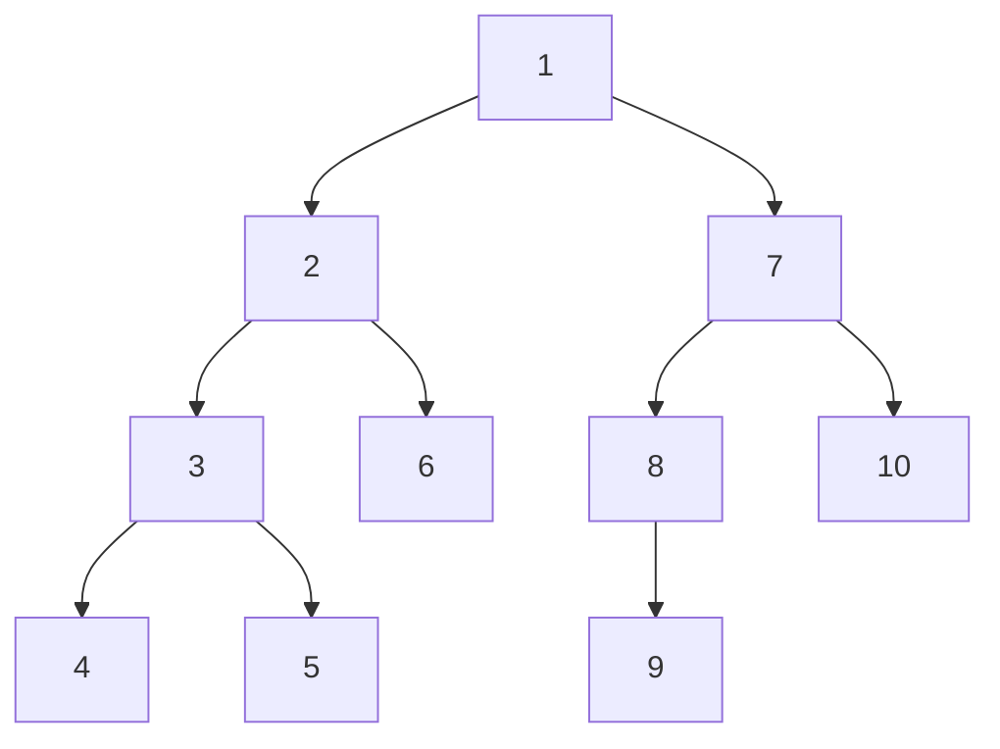

### Notes on BFS (Breadth-First Search) Traversal

**Introduction**  
- BFS is a critical traversal technique for solving graph problems.  
- It explores nodes level by level (breadth-wise), ensuring all nodes at a given distance from the starting node are visited before moving to the next level.  

---

**BFS Concept**  
- **Key Terms**:  
  - *Breadth*: Refers to exploring all nodes at the same level (distance) before moving deeper.  
  - *Level-wise Traversal*: Nodes are visited in layers (level 0 → level 1 → level 2 → ...).  
- **Graph Types**: Works with both 1-based and 0-based indexed graphs.  

---

**Traversal Steps**  
1. **Initial Configuration**:  
   - Use a **queue** (FIFO) to manage nodes.  
   - Maintain a **visited array** to track processed nodes.  
   - Start with the initial node in the queue and mark it as visited.  

2. **Processing Nodes**:  
   - Dequeue a node.  
   - Print or process the node.  
   - Enqueue **unvisited neighbors** and mark them as visited.  

---

**Example Walkthrough**  
**Graph Structure**:  
- Nodes: 1, 2, 3, 4, 5, 6, 7, 8, 9 (1-based indexing).  
- Adjacency List:  
  - Node 1 → [2, 6]  
  - Node 2 → [1, 3, 4]  
  - Node 6 → [1, 7, 9] (etc.)  

**Starting Node 1**:  
- **Level 0**: 1.  
- **Level 1**: 2, 6 (added from 1’s neighbors).  
- **Level 2**: 3, 4, 7, 9 (neighbors of 2 and 6).  
- **Level 3**: 5, 8, etc.  

---

**Code Examples** 

**Java Code**:  
```java
public List<Integer> bfsOfGraph(int V, List<List<Integer>> adj) {
    List<Integer> bfs = new ArrayList<>();
    boolean[] visited = new boolean[V];
    Queue<Integer> q = new LinkedList<>();
    
    visited[0] = true; // Assuming 0-based index
    q.add(0);
    
    while (!q.isEmpty()) {
        int node = q.poll();
        bfs.add(node);
        
        for (int neighbor : adj.get(node)) {
            if (!visited[neighbor]) {
                visited[neighbor] = true;
                q.add(neighbor);
            }
        }
    }
    return bfs;
}
```

**Key Components**:  
- **Queue**: Manages traversal order (FIFO).  
- **Visited Array**: Prevents revisiting nodes.  
- **Adjacency List**: Stores graph connections.  
**C++ Code**:  
```cpp
vector<int> bfsOfGraph(int V, vector<int> adj[]) {
    vector<int> bfs;
    vector<bool> visited(V, false);
    queue<int> q;
    
    visited[0] = true; // Assuming 0-based index
    q.push(0);
    
    while (!q.empty()) {
        int node = q.front();
        q.pop();
        bfs.push_back(node);
        
        for (int neighbor : adj[node]) {
            if (!visited[neighbor]) {
                visited[neighbor] = true;
                q.push(neighbor);
            }
        }
    }
    return bfs;
}
```
---

**Complexity Analysis**  
- **Time Complexity**: O(N + M), where N is nodes and M is edges.  
  - Each node and edge are processed once.  
- **Space Complexity**: O(N)  
  - Queue and visited array storage.  

---

**When to Use?**

- Do we need to explore all complete paths? **(no)**
- Do we need to backtrack to explore different branches? (**no)**
- Do we need to do a level order traversal? **(yes)**

**CHOOSE BFS**

**Summary**  
BFS systematically explores nodes level by level using a queue, ensuring efficient traversal with linear time and space complexity. Understanding BFS is foundational for solving numerous graph-related problems.
User: you are not able to see graph properly. see now.
Kimi: Let's perform a dry run of the Breadth-First Search (BFS) algorithm on the provided graph starting from node **1**. Here's the step-by-step traversal:

---

### **Graph Structure**
```
1
├── 2
│   ├── 3
│   │   ├── 4
│   │   └── 5
│   └── 6
└── 7
    ├── 8
    │   └── 9
    └── 10
```

### **Mermaid Visualization**


---

### **BFS Traversal Steps**
1. **Initialize**:  
   - `visited = [False] * 11` (nodes 1–10).  
   - `queue = [1]` (start at node 1).  
   - `bfs_order = []`.  

2. **Process Node 1**:  
   - Mark node 1 as visited.  
   - Enqueue neighbors **2** and **7**.  
   - `queue = [2, 7]`.  
   - `bfs_order = [1]`.  

3. **Process Node 2**:  
   - Mark node 2 as visited.  
   - Enqueue neighbors **3** and **6**.  
   - `queue = [7, 3, 6]`.  
   - `bfs_order = [1, 2]`.  

4. **Process Node 7**:  
   - Mark node 7 as visited.  
   - Enqueue neighbors **8** and **10**.  
   - `queue = [3, 6, 8, 10]`.  
   - `bfs_order = [1, 2, 7]`.  

5. **Process Node 3**:  
   - Mark node 3 as visited.  
   - Enqueue neighbors **4** and **5**.  
   - `queue = [6, 8, 10, 4, 5]`.  
   - `bfs_order = [1, 2, 7, 3]`.  

6. **Process Node 6**:  
   - Mark node 6 as visited.  
   - No new neighbors to enqueue.  
   - `queue = [8, 10, 4, 5]`.  
   - `bfs_order = [1, 2, 7, 3, 6]`.  

7. **Process Node 8**:  
   - Mark node 8 as visited.  
   - Enqueue neighbor **9**.  
   - `queue = [10, 4, 5, 9]`.  
   - `bfs_order = [1, 2, 7, 3, 6, 8]`.  

8. **Process Node 10**:  
   - Mark node 10 as visited.  
   - No new neighbors to enqueue.  
   - `queue = [4, 5, 9]`.  
   - `bfs_order = [1, 2, 7, 3, 6, 8, 10]`.  

9. **Process Node 4**:  
   - Mark node 4 as visited.  
   - No new neighbors to enqueue.  
   - `queue = [5, 9]`.  
   - `bfs_order = [1, 2, 7, 3, 6, 8, 10, 4]`.  

10. **Process Node 5**:  
    - Mark node 5 as visited.  
    - No new neighbors to enqueue.  
    - `queue = [9]`.  
    - `bfs_order = [1, 2, 7, 3, 6, 8, 10, 4, 5]`.  

11. **Process Node 9**:  
    - Mark node 9 as visited.  
    - No new neighbors to enqueue.  
    - `queue = []`.  
    - `bfs_order = [1, 2, 7, 3, 6, 8, 10, 4, 5, 9]`.  

---

### **Final BFS Order**  
`1 → 2 → 7 → 3 → 6 → 8 → 10 → 4 → 5 → 9`

---


The BFS traversal explores nodes level-by-level, starting from node 1 and visiting all nodes at each depth before moving deeper.

